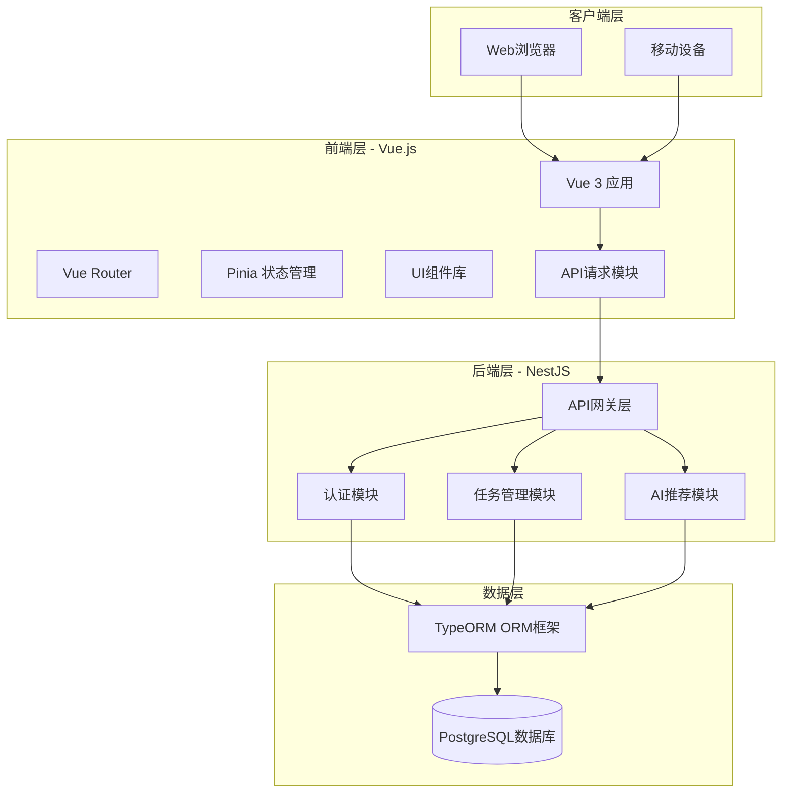
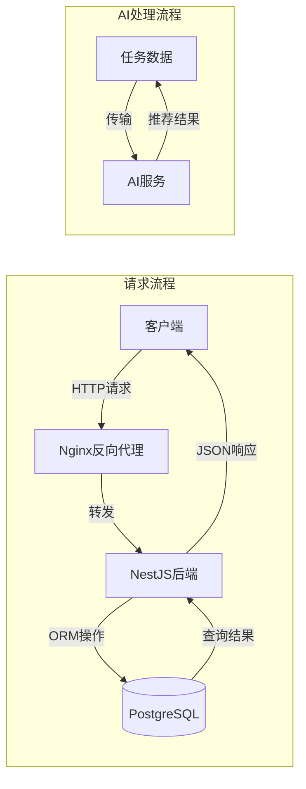
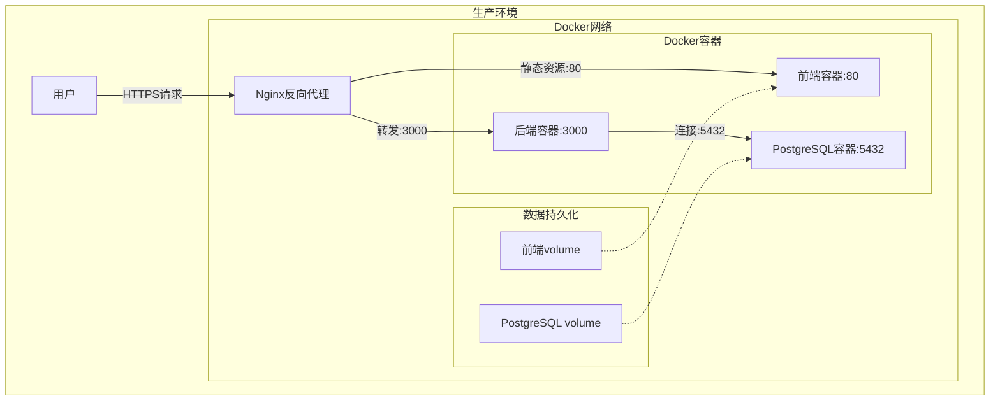

# 技术架构概述

本文档描述智能待办事项管理系统的整体技术架构，包括系统架构图、技术栈选型、项目目录结构以及部署架构。

## 1. 系统架构图

### 1.1 整体架构

本系统采用经典的**前后端分离架构**，前端使用Vue.js构建单页面应用(SPA)，后端使用NestJS构建RESTful API服务，数据库使用PostgreSQL。



### 1.2 数据流架构



## 2. 技术栈选型

### 2.1 前端技术栈

| 技术 | 版本 | 用途 |
|------|------|------|
| Vue.js | 3.x | 前端框架 |
| Vue Router | 4.x | 路由管理 |
| Pinia | 2.x | 状态管理 |
| TailwindCSS | 3.x | CSS框架 |
| Vite | 5.x | 构建工具 |
| Axios | 1.x | HTTP客户端 |

**前端架构特点**：
- **Composition API**：使用Vue 3的组合式API进行开发
- **组件化开发**：模块化、可复用的组件结构
- **状态管理**：使用Pinia进行全局状态管理
- **响应式设计**：适配不同尺寸的设备屏幕
- **暗色模式**：支持明暗主题切换

### 2.2 后端技术栈

| 技术 | 版本 | 用途 |
|------|------|------|
| NestJS | 10.x | 后端框架 |
| TypeORM | 0.3.x | ORM框架 |
| PostgreSQL | 14+ | 关系型数据库 |
| Passport-JWT | 4.x | JWT认证 |
| Class-validator | 0.14.x | 数据验证 |
| Docker | 24.x | 容器化 |

**后端架构特点**：
- **模块化设计**：按功能模块划分（Auth、Tasks、AI）
- **依赖注入**：使用NestJS的依赖注入容器
- **装饰器模式**：大量使用TypeScript装饰器
- **ORM映射**：使用TypeORM进行数据库操作
- **JWT认证**：无状态的用户认证机制

### 2.3 数据库技术栈

| 技术 | 用途 |
|------|------|
| PostgreSQL | 主数据库 |
| TypeORM | 对象关系映射 |
| UUID | 主键生成策略 |

## 3. 项目目录结构

### 3.1 整体目录结构

```
full_web_demo_minimax/
├── backend/                 # 后端项目
│   ├── src/                # 源代码
│   │   ├── auth/          # 认证模块
│   │   ├── tasks/         # 任务管理模块
│   │   ├── ai/            # AI推荐模块
│   │   ├── app.module.ts  # 根模块
│   │   └── main.ts        # 入口文件
│   ├── dist/              # 编译输出
│   ├── package.json
│   └── tsconfig.json
├── frontend/              # 前端项目
│   ├── src/              # 源代码
│   │   ├── api/         # API接口封装
│   │   ├── components/  # 公共组件
│   │   ├── views/       # 页面视图
│   │   ├── stores/      # 状态管理
│   │   ├── router/      # 路由配置
│   │   ├── App.vue      # 根组件
│   │   └── main.js      # 入口文件
│   ├── package.json
│   └── vite.config.js
├── doc/                  # 技术文档
├── docker-compose.yml    # Docker编排文件
└── README.md            # 项目说明
```

### 3.2 后端目录结构详解

```
backend/src/
├── auth/                          # 认证模块
│   ├── auth.controller.ts        # 认证控制器
│   ├── auth.service.ts           # 认证服务
│   ├── auth.module.ts            # 认证模块
│   ├── jwt.strategy.ts           # JWT策略
│   ├── jwt-auth.guard.ts         # JWT守卫
│   └── user.entity.ts            # 用户实体
├── tasks/                         # 任务模块
│   ├── tasks.controller.ts       # 任务控制器
│   ├── tasks.service.ts          # 任务服务
│   ├── tasks.module.ts           # 任务模块
│   ├── task.entity.ts            # 任务实体
│   └── task.dto.ts               # 任务DTO
├── ai/                            # AI模块
│   ├── ai.controller.ts         # AI控制器
│   ├── ai.service.ts            # AI服务
│   └── ai.module.ts             # AI模块
├── app.module.ts                 # 根模块
└── main.ts                       # 应用入口
```

### 3.3 前端目录结构详解

```
frontend/src/
├── api/                          # API接口
│   └── index.js                  # Axios封装
├── components/                   # 公共组件
│   ├── TaskItem.vue             # 任务项组件
│   ├── TaskForm.vue             # 任务表单组件
│   └── AISuggestion.vue         # AI推荐组件
├── views/                        # 页面视图
│   ├── HomeView.vue             # 首页
│   └── LoginView.vue            # 登录页
├── stores/                       # 状态管理
│   ├── auth.js                  # 认证状态
│   ├── tasks.js                 # 任务状态
│   └── theme.js                 # 主题状态
├── router/                       # 路由
│   └── index.js                 # 路由配置
├── App.vue                       # 根组件
├── main.js                       # 入口文件
└── style.css                     # 全局样式
```

## 4. 部署架构

### 4.1 Docker部署架构



### 4.2 容器配置说明

**docker-compose.yml 配置**：

```yaml
version: '3.8'

services:
  # 前端服务
  frontend:
    build: ./frontend
    ports:
      - "80:80"
    depends_on:
      - backend

  # 后端服务
  backend:
    build: ./backend
    ports:
      - "3000:3000"
    environment:
      - NODE_ENV=production
      - DB_HOST=postgres
      - DB_PORT=5432
    depends_on:
      - postgres

  # 数据库服务
  postgres:
    image: postgres:14-alpine
    environment:
      - POSTGRES_DB=todolist
      - POSTGRES_USER=postgres
      - POSTGRES_PASSWORD=postgres
    volumes:
      - postgres_data:/var/lib/postgresql/data
    ports:
      - "5432:5432"

volumes:
  postgres_data:
```

### 4.3 环境变量配置

**后端环境变量 (.env)**：

```env
# 数据库配置
DB_HOST=localhost
DB_PORT=5432
DB_USERNAME=postgres
DB_PASSWORD=postgres
DB_NAME=todolist

# JWT配置
JWT_SECRET=your-super-secret-jwt-key
JWT_EXPIRATION=24h

# AI服务配置
AI_API_KEY=your-api-key
AI_ENDPOINT=https://api.example.com

# 服务器配置
PORT=3000
NODE_ENV=development
```

## 5. 系统特性

### 5.1 安全性设计

- **JWT认证**：无状态的身份验证机制
- **密码加密**：使用bcrypt加密存储
- **SQL注入防护**：使用TypeORM参数化查询
- **XSS防护**：前端Vue自动转义
- **CORS配置**：严格的跨域资源共享策略

### 5.2 性能优化

- **数据库索引**：关键字段建立索引
- **连接池**：数据库连接池管理
- **懒加载**：前端路由懒加载
- **CDN加速**：静态资源CDN分发
- **Gzip压缩**：HTTP响应压缩

### 5.3 可扩展性

- **模块化架构**：功能模块解耦
- **微服务准备**：支持水平扩展
- **API设计**：RESTful风格，易于对接
- **插件机制**：支持功能扩展

## 6. 开发规范

### 6.1 代码规范

- **ESLint**：JavaScript/TypeScript代码检查
- **Prettier**：代码格式化
- **Git Hooks**：提交前自动检查
- **Commit Message**：Conventional Commits规范

### 6.2 分支管理

- **main**：主分支，稳定版本
- **develop**：开发分支
- **feature/***：功能分支
- **hotfix/***：紧急修复分支

---

## 7. 监控与日志

### 7.1 日志级别

```typescript
// 日志级别定义
const LOG_LEVELS = {
  error: 0,   // 错误
  warn: 1,    // 警告
  info: 2,    // 信息
  debug: 3,   // 调试
  verbose: 4  // 详细
};
```

### 7.2 监控指标

- **请求响应时间**：API响应时间监控
- **错误率**：请求失败率统计
- **数据库连接**：连接池使用情况
- **内存使用**：JVM/Node.js内存监控

---

## 8. 文档版本

| 版本 | 日期 | 修改内容 | 作者 |
|------|------|----------|------|
| v1.0.0 | 2026-01-14 | 初始版本 | 开发团队 |
