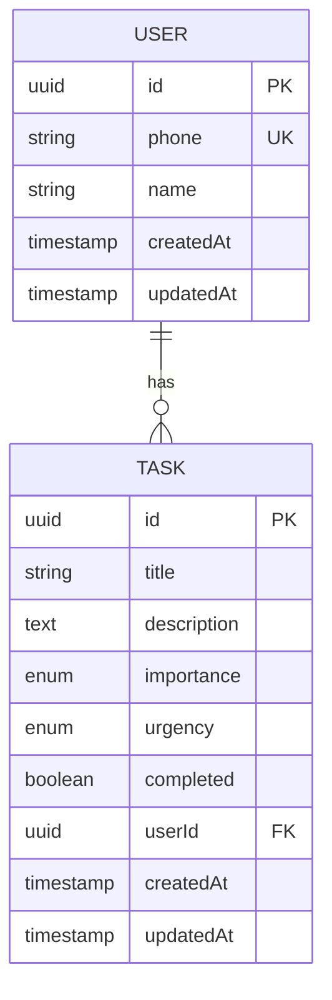
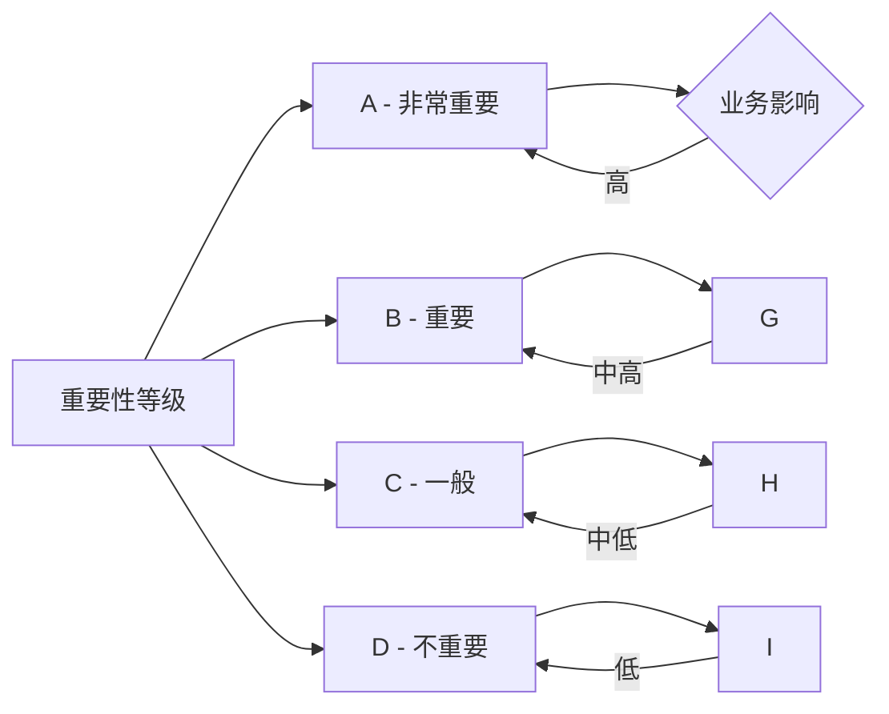
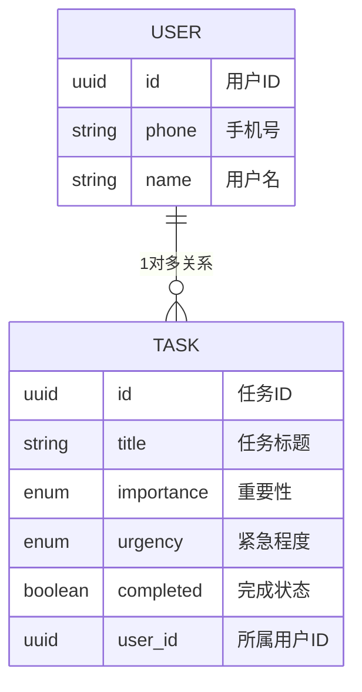

# 核心数据结构

本文档描述智能待办事项管理系统的核心数据结构设计，包括用户实体、任务实体、枚举类型定义以及数据关系图。

## 1. 数据模型概览

### 1.1 实体关系图



### 1.2 数据表结构

| 表名 | 说明 | 关联 |
|------|------|------|
| users | 用户表 | 主表 |
| tasks | 任务表 | 从表，关联users |

## 2. 用户实体 (User)

### 2.1 实体定义

用户实体存储系统用户的基本信息，采用手机号作为唯一标识。

```typescript
// user.entity.ts
import { 
  Entity, 
  Column, 
  PrimaryGeneratedColumn, 
  CreateDateColumn, 
  UpdateDateColumn,
  OneToMany
} from 'typeorm';
import { Task } from '../tasks/task.entity';

@Entity('users')
export class User {
  @PrimaryGeneratedColumn('uuid')
  id: string;

  @Column({ unique: true })
  phone: string;

  @Column({ nullable: true })
  name: string;

  @OneToMany(() => Task, task => task.user)
  tasks: Task[];

  @CreateDateColumn()
  createdAt: Date;

  @UpdateDateColumn()
  updatedAt: Date;
}
```

### 2.2 字段说明

| 字段名 | 类型 | 约束 | 说明 |
|--------|------|------|------|
| id | UUID | PRIMARY KEY | 主键，自动生成 |
| phone | VARCHAR(20) | UNIQUE, NOT NULL | 手机号，唯一索引 |
| name | VARCHAR(100) | NULLABLE | 用户昵称，可选 |
| createdAt | TIMESTAMP | DEFAULT NOW() | 创建时间 |
| updatedAt | TIMESTAMP | DEFAULT NOW() | 更新时间 |

### 2.3 数据库建表SQL

```sql
CREATE TABLE users (
    id UUID PRIMARY KEY DEFAULT gen_random_uuid(),
    phone VARCHAR(20) NOT NULL UNIQUE,
    name VARCHAR(100),
    created_at TIMESTAMP WITH TIME ZONE DEFAULT CURRENT_TIMESTAMP,
    updated_at TIMESTAMP WITH TIME ZONE DEFAULT CURRENT_TIMESTAMP
);

-- 创建索引
CREATE INDEX idx_users_phone ON users(phone);
CREATE INDEX idx_users_created_at ON users(created_at DESC);
```

### 2.4 数据示例

```json
{
  "id": "550e8400-e29b-41d4-a716-446655440000",
  "phone": "13800138000",
  "name": "张三",
  "createdAt": "2026-01-14T10:00:00.000Z",
  "updatedAt": "2026-01-14T10:00:00.000Z",
  "tasks": []
}
```

## 3. 任务实体 (Task)

### 3.1 实体定义

任务实体存储待办事项的详细信息，包括任务的标题、描述、重要程度、紧急程度和完成状态。

```typescript
// task.entity.ts
import { 
  Entity, 
  Column, 
  PrimaryGeneratedColumn, 
  CreateDateColumn, 
  UpdateDateColumn,
  ManyToOne,
  JoinColumn
} from 'typeorm';
import { User } from '../auth/user.entity';

// 任务重要性枚举
export enum TaskImportance {
  A = 'A',  // 非常重要
  B = 'B',  // 重要
  C = 'C',  // 一般
  D = 'D'   // 不重要
}

// 任务紧急程度枚举
export enum TaskUrgency {
  VERY_URGENT = 1,  // 非常紧急
  URGENT = 2,       // 紧急
  NORMAL = 3,       // 普通
  NOT_URGENT = 4    // 不紧急
}

@Entity('tasks')
export class Task {
  @PrimaryGeneratedColumn('uuid')
  id: string;

  @Column()
  title: string;

  @Column({ type: 'text', nullable: true })
  description: string;

  @Column({
    type: 'enum',
    enum: TaskImportance,
    default: TaskImportance.B
  })
  importance: TaskImportance;

  @Column({
    type: 'enum',
    enum: TaskUrgency,
    default: TaskUrgency.NORMAL
  })
  urgency: TaskUrgency;

  @Column({ default: false })
  completed: boolean;

  @Column({ nullable: true })
  userId: string;

  @ManyToOne(() => User, { onDelete: 'CASCADE' })
  @JoinColumn({ name: 'userId' })
  user: User;

  @CreateDateColumn()
  createdAt: Date;

  @UpdateDateColumn()
  updatedAt: Date;
}
```

### 3.2 字段说明

| 字段名 | 类型 | 约束 | 默认值 | 说明 |
|--------|------|------|--------|------|
| id | UUID | PRIMARY KEY | 自动生成 | 主键 |
| title | VARCHAR(255) | NOT NULL | - | 任务标题 |
| description | TEXT | NULLABLE | null | 任务描述详情 |
| importance | ENUM(A,B,C,D) | NOT NULL | 'B' | 重要性等级 |
| urgency | ENUM(1,2,3,4) | NOT NULL | 3 | 紧急程度 |
| completed | BOOLEAN | NOT NULL | false | 完成状态 |
| userId | UUID | FOREIGN KEY | null | 所属用户ID |
| createdAt | TIMESTAMP | DEFAULT | NOW() | 创建时间 |
| updatedAt | TIMESTAMP | DEFAULT | NOW() | 更新时间 |

### 3.3 重要性等级说明



**等级定义**：

| 等级 | 标签 | 说明 | 建议处理时间 |
|------|------|------|-------------|
| A | 非常重要 | 对业务有重大影响，必须优先处理 | 当天 |
| B | 重要 | 对个人有较大影响，需要尽快处理 | 本周内 |
| C | 一般 | 普通任务，按计划处理 | 本月内 |
| D | 不重要 | 低优先级，可延后处理 | 有空时 |

### 3.4 紧急程度说明

| 等级 | 值 | 标签 | 说明 | 示例 |
|------|------|------|------|------|
| 1 | VERY_URGENT | 非常紧急 | 立即需要处理 | 紧急bug、系统故障 |
| 2 | URGENT | 紧急 | 需要尽快处理 | 即将到来的截止日期 |
| 3 | NORMAL | 普通 | 按正常节奏处理 | 常规工作任务 |
| 4 | NOT_URGENT | 不紧急 | 可安排到以后 | 学习、提升类任务 |

### 3.5 数据库建表SQL

```sql
-- 创建任务重要性枚举类型
CREATE TYPE task_importance AS ENUM ('A', 'B', 'C', 'D');

-- 创建任务紧急程度枚举类型
CREATE TYPE task_urgency AS ENUM (1, 2, 3, 4);

-- 创建任务表
CREATE TABLE tasks (
    id UUID PRIMARY KEY DEFAULT gen_random_uuid(),
    title VARCHAR(255) NOT NULL,
    description TEXT,
    importance task_importance NOT NULL DEFAULT 'B',
    urgency task_urgency NOT NULL DEFAULT 3,
    completed BOOLEAN NOT NULL DEFAULT FALSE,
    user_id UUID REFERENCES users(id) ON DELETE CASCADE,
    created_at TIMESTAMP WITH TIME ZONE DEFAULT CURRENT_TIMESTAMP,
    updated_at TIMESTAMP WITH TIME ZONE DEFAULT CURRENT_TIMESTAMP
);

-- 创建索引
CREATE INDEX idx_tasks_user_id ON tasks(user_id);
CREATE INDEX idx_tasks_completed ON tasks(completed);
CREATE INDEX idx_tasks_importance ON tasks(importance);
CREATE INDEX idx_tasks_urgency ON tasks(urgency);
CREATE INDEX idx_tasks_created_at ON tasks(created_at DESC);
```

### 3.6 数据示例

```json
{
  "id": "task-uuid-1234",
  "title": "完成项目文档",
  "description": "撰写技术架构文档并提交到代码仓库",
  "importance": "A",
  "urgency": 2,
  "completed": false,
  "userId": "550e8400-e29b-41d4-a716-446655440000",
  "createdAt": "2026-01-14T10:00:00.000Z",
  "updatedAt": "2026-01-14T10:30:00.000Z"
}
```

## 4. 数据关系

### 4.1 用户与任务关系



### 4.2 级联操作

当删除用户时，该用户的所有任务会自动删除：

```sql
-- 删除用户及其所有任务
DELETE FROM users WHERE id = 'user-uuid-1234';
-- 相关任务会自动删除（ON DELETE CASCADE）
```

### 4.3 任务查询示例

**查询用户的所有任务**：

```sql
SELECT * FROM tasks 
WHERE user_id = 'user-uuid-1234'
ORDER BY 
  importance DESC,
  urgency ASC,
  created_at DESC;
```

**按状态分组统计**：

```sql
SELECT 
  completed,
  COUNT(*) as count
FROM tasks
WHERE user_id = 'user-uuid-1234'
GROUP BY completed;
```

**按重要性和紧急程度统计**：

```sql
SELECT 
  importance,
  urgency,
  COUNT(*) as count
FROM tasks
WHERE user_id = 'user-uuid-1234'
  AND completed = false
GROUP BY importance, urgency
ORDER BY importance DESC, urgency ASC;
```

## 5. DTO数据传输对象

### 5.1 创建任务DTO

```typescript
// task.dto.ts
import { IsString, IsNotEmpty, IsOptional, IsEnum, IsBoolean } from 'class-validator';
import { TaskImportance, TaskUrgency } from './task.entity';

export class CreateTaskDto {
  @IsString()
  @IsNotEmpty({ message: '任务标题不能为空' })
  title: string;

  @IsString()
  @IsOptional()
  description?: string;

  @IsEnum(TaskImportance)
  @IsOptional()
  importance?: TaskImportance;

  @IsEnum(TaskUrgency)
  @IsOptional()
  urgency?: TaskUrgency;
}
```

### 5.2 更新任务DTO

```typescript
export class UpdateTaskDto {
  @IsString()
  @IsOptional()
  title?: string;

  @IsString()
  @IsOptional()
  description?: string;

  @IsEnum(TaskImportance)
  @IsOptional()
  importance?: TaskImportance;

  @IsEnum(TaskUrgency)
  @IsOptional()
  urgency?: TaskUrgency;

  @IsBoolean()
  @IsOptional()
  completed?: boolean;
}
```

### 5.3 AI建议DTO

```typescript
export class SuggestionDto {
  @IsArray()
  @IsOptional()
  tasks?: Array<{
    id: string;
    title: string;
    description?: string;
    importance: string;
    urgency: number;
    completed: boolean;
  }>;
}
```

## 6. 索引优化

### 6.1 数据库索引设计

```sql
-- 单列索引
CREATE INDEX idx_tasks_user_id ON tasks(user_id);
CREATE INDEX idx_tasks_completed ON tasks(completed);
CREATE INDEX idx_tasks_importance ON tasks(importance);
CREATE INDEX idx_tasks_urgency ON tasks(urgency);
CREATE INDEX idx_tasks_created_at ON tasks(created_at DESC);

-- 复合索引 - 支持多条件排序查询
CREATE INDEX idx_tasks_user_completed ON tasks(user_id, completed);
CREATE INDEX idx_tasks_user_importance_urgency ON tasks(user_id, importance DESC, urgency ASC);
```

### 6.2 性能优化建议

| 场景 | 建议索引 | 预期效果 |
|------|---------|---------|
| 按用户查询任务 | idx_tasks_user_id | O(log n) |
| 按状态筛选 | idx_tasks_completed | O(log n) |
| 按优先级排序 | idx_tasks_user_importance_urgency | O(log n) |
| 统计用户任务数 | 已有索引 | O(1) |

## 7. 数据校验规则

### 7.1 前端校验

```javascript
// 任务表单校验
const validateTask = (task) => {
  const errors = [];
  
  if (!task.title || task.title.trim() === '') {
    errors.push('任务标题不能为空');
  }
  
  if (task.title && task.title.length > 255) {
    errors.push('任务标题不能超过255个字符');
  }
  
  if (task.description && task.description.length > 5000) {
    errors.push('任务描述不能超过5000个字符');
  }
  
  const validImportance = ['A', 'B', 'C', 'D'];
  if (task.importance && !validImportance.includes(task.importance)) {
    errors.push('无效的重要性等级');
  }
  
  const validUrgency = [1, 2, 3, 4];
  if (task.urgency && !validUrgency.includes(task.urgency)) {
    errors.push('无效的紧急程度');
  }
  
  return errors;
};
```

### 7.2 后端校验

```typescript
// 使用class-validator进行校验
import { IsString, IsNotEmpty, IsOptional, IsEnum, MinLength, MaxLength } from 'class-validator';

export class CreateTaskDto {
  @IsString()
  @IsNotEmpty()
  @MinLength(1)
  @MaxLength(255)
  title: string;

  @IsString()
  @IsOptional()
  @MaxLength(5000)
  description?: string;

  @IsEnum(TaskImportance)
  @IsOptional()
  importance?: TaskImportance;

  @IsEnum(TaskUrgency)
  @IsOptional()
  urgency?: TaskUrgency;
}
```

## 8. 版本信息

| 版本 | 日期 | 修改内容 | 作者 |
|------|------|----------|------|
| v1.0.0 | 2026-01-14 | 初始版本 | 开发团队 |
